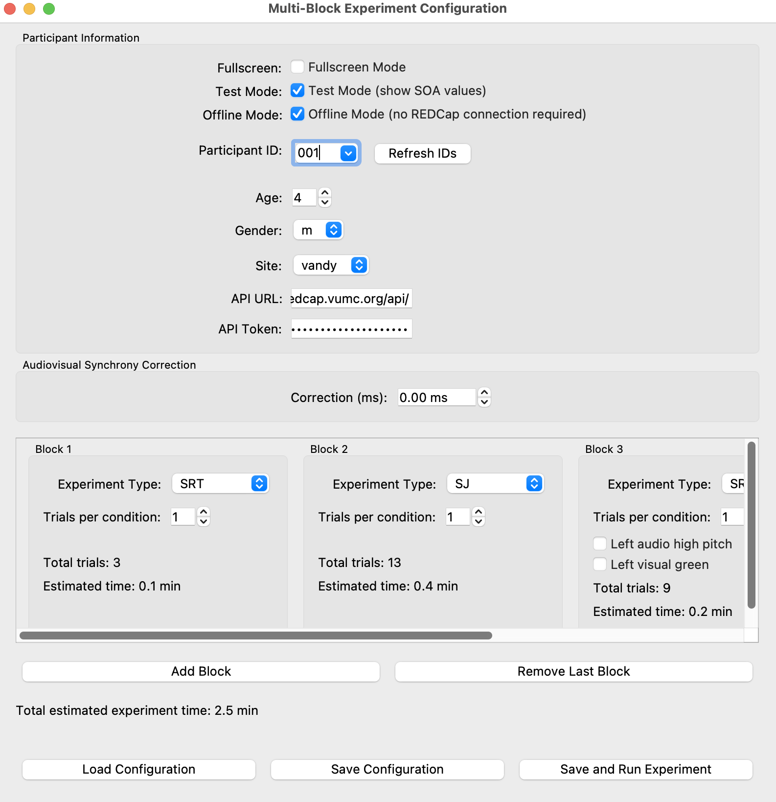

# Python MSI Suite
This repository contains a Python-based application for running customized multi-block psychophysical experiments. The experiments are designed to measure sensory processing and reaction times under various audiovisual conditions. The application provides a GUI for configuring experiments and supports data collection and integration with REDCap for data management.


## Table of Contents
- [Features](#features)
- [Prerequisites](#prerequisites)
- [Installation](#installation)
- [Usage](#usage)
  - [Launching the GUI](#launching-the-gui)
  - [Configuring Experiments](#configuring-experiments)
  - [Running Experiments](#running-experiments)
- [Data Management](#data-management)
- [Experiment Types](#experiment-types)
- [Customization](#customization)
- [Troubleshooting](#troubleshooting)
- [Contributing](#contributing)
- [License](#license)

## Features

Experiment Configuration GUI: Easily configure participant information and experiment blocks without editing code.
Multi-Block Support: Run a series of experiments with different configurations in a single session.
Data Integration with REDCap: Automatically upload collected data to REDCap for centralized management.
Audiovisual Synchrony Correction: Adjust for hardware-induced discrepancies between audio and visual stimuli.
Support for Various Experiment Types: Including Simultaneity Judgment (SJ), Simple Reaction Time (SRT), and their modified versions.

## Prerequisites

- Anaconda or Miniconda (for conda environment management)
- Python 3.10 or higher
- PsychoPy: For running the experiments.
- PyQt5: For the GUI application.
- Redcap: Python module for interacting with REDCap API.
- Additional Libraries:
  - numpy
  - json
  - csv
  - platform
  - random
  - os
  - sys
  - datetime
  - subprocess

## Installation

1. **Clone the Repository**

   ```bash
   git clone https://github.com/yourusername/Python-MSI-Suite.git
   cd Python-MSI-Suite
   ```

2. **Create and Activate a Conda Environment Using the Provided YAML File**

   ```bash
   conda env create -f environment.yaml
   conda activate python-suite
   ```

   This command creates a new conda environment named `python-suite` with all the required packages specified in `environment.yaml`.

3. **(Optional) Install Additional Packages**

   If you need to install additional packages or face issues with the provided environment, you can install required packages manually.

   ```bash
   pip install -r requirements.txt
   ```

   *(Note: Ensure that you are in the `python-suite` environment when running this command.)*

Configure REDCap API Credentials *(Optional)*

If you wish to integrate with REDCap, create a file named `api_text.txt` in the root directory.

Add the following lines with your REDCap API URL and token:

```text
api_url=https://your_redcap_url/api/
api_token=your_api_token_here
```

**Note:** If you do not provide REDCap API credentials, you can still run the program offline. The data will be saved locally without being uploaded to REDCap.

## Setting Up REDCap API

To integrate the application with REDCap, follow these steps:

1. **Receive REDCap Invitation**
   - You will receive an invitation to access the REDCap project. Follow the instructions in the invitation to create your account and log in.

2. **Obtain Your API Token**
   - Once logged in, navigate to the "API" section in the REDCap interface. This can be accessed by clicking on the "API" button highlighted in the image below:
   
   
   
   - In the API section, you will find your API token. Copy this token as it will be required for the application:
   
   

3. **Find Your API URL**
   - Click on the "REDCap API documentation" link in the API section. This will take you to the documentation page.
   - On the documentation page, locate the URL for the API, as shown below:
   
   

4. **Configure the Application**
   - Create a file named `api_text.txt` in the root directory of the application.
   - Add the following lines to the file, replacing `your_redcap_url` and `your_api_token_here` with the URL and token you obtained:

     ```text
     api_url=https://your_redcap_url/api/
     api_token=your_api_token_here
     ```

   - Save the file. The application will now use these credentials to connect to REDCap.

## Usage
### Launching the Experiment Configuration GUI
Run the following command in your terminal:

   ```bash
   python experiment_config_gui.py
   ```
### Configuring Experiments
#### Participant Information
Participant ID: Select or enter a participant ID. Existing IDs from REDCap will be loaded automatically.
Age: Enter the participant's age.
Gender: Select the participant's gender.
Site: Choose the site where the experiment is conducted.
Fullscreen Mode: Check this option to run experiments in fullscreen.
#### Audiovisual Synchrony Correction
Adjust the synchronization between audio and visual stimuli by entering a correction value in milliseconds.
#### Blocks Configuration
Click on "Add Block" to introduce a new experimental block.
For each block:
Experiment Type: Choose from SJ, SRT, SRT_Mod, SJ_Mod.
Trials per Condition: Set the number of trials for each condition.
Additional Options: Depending on the experiment type, additional configuration options may appear (e.g., left audio high pitch).
#### Estimated Experiment Time
The application automatically calculates and displays the total estimated time for the experiment based on your configurations.

#### Saving and Loading Configurations
Save Configuration: Click on "Save Configuration" to save your current setup to a JSON file.
Load Configuration: Use "Load Configuration" to load a previously saved setup.
The application also saves your REDCap API credentials when you save a configuration.
### Running Experiments
After configuring your experiment:

Click on "Save and Run Experiment".
The application will prompt you that it will start in a separate process and the GUI will close.
The experiment will begin running, displaying stimuli according to your configuration.
Note: Ensure your system volume is appropriate, and the participant is ready before starting.

## Data Management
### Local Data Saving
Data collected during the experiments are saved locally in CSV format.
Filenames include participant ID, age, gender, site, and a timestamp for easy identification.
Example filename: data_001_25_m_vandy_20231115_123456.csv
### Uploading Data to REDCap *(Optional)*
If REDCap API credentials are provided, collected data are automatically uploaded to REDCap using the provided API credentials.
Demographic data and experimental results are stored as separate records for better organization.
**If no REDCap API URL or API token is provided, the program will run offline and save the data locally without attempting to upload to REDCap.**
## Experiment Types
### SJ (Simultaneity Judgment)
Participants judge whether audio and visual stimuli occur simultaneously.

Stimuli: Red circle (visual), tone (audio).
Response: Press '1' for same time, '2' for different times.
### SRT (Simple Reaction Time)
Participants respond as quickly as possible when they detect a stimulus.

Stimuli: Either visual, auditory, or both.
Response: Press the spacebar upon detection.
### SRT_Mod (Modified Simple Reaction Time)
An extension of SRT with lateralized stimuli and varied pitches/colors.

Stimuli: Left/right/bilateral presentations with low/high pitches and green/red circles.
Customization: Options to set left/right attributes.
### SJ_Mod (Modified Simultaneity Judgment)
Combines elements of SJ and SRT_Mod for more complex judgment tasks.

Stimuli: Various SOAs (Stimulus Onset Asynchronies), lateralized stimuli.
Response: Similar to SJ but includes side distinctions.
## Customization
Experiment parameters such as stimulus duration, colors, and positions can be customized in the code if needed.
Audio files (tone.wav, low_pitch.wav, high_pitch.wav) can be replaced with alternatives, but ensure filenames match those in the code.
## Troubleshooting
Application Won't Start: Ensure all prerequisites are installed and you're running the correct Python version.
Audio Issues: Check your system's audio settings and that the correct audio library (PTB) is available.
REDCap Connection Errors: Verify your API URL and token. Ensure you have network connectivity.
